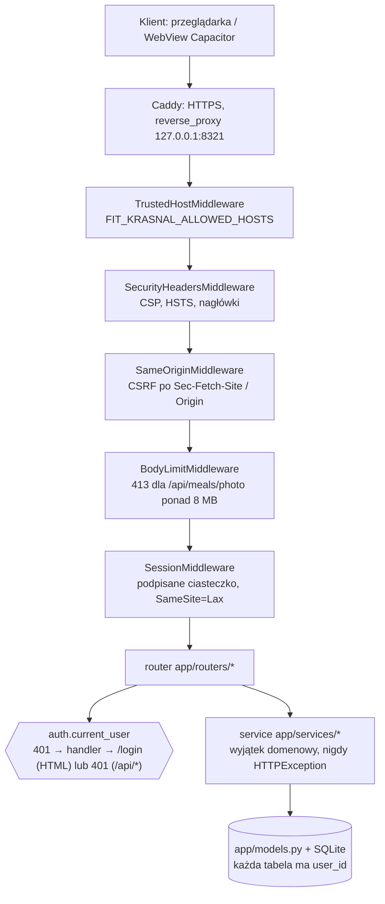
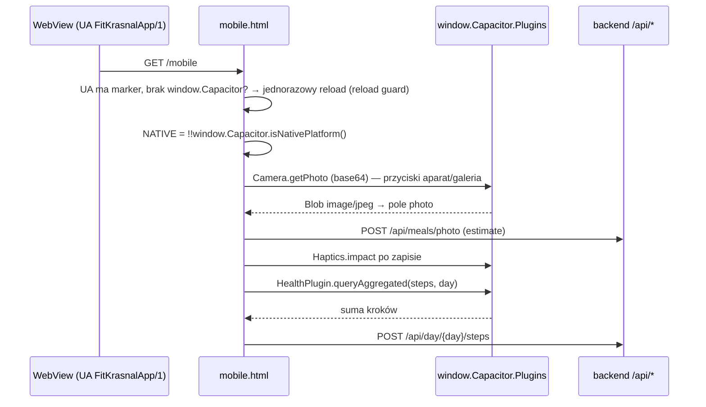
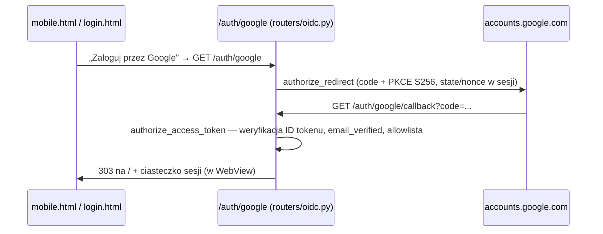
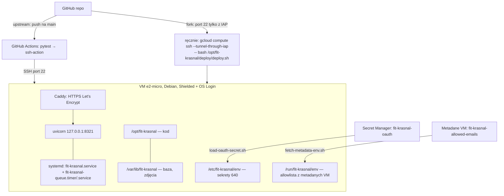

# Architektura Fit Krasnal

Mapa kodu pod czytanie — dla człowieka i dla asystenta LLM. Wszystkie
twierdzenia pochodzą z kodu (stan: VERSION 25.6.0). Konwencje i reguły pracy są
w [CLAUDE.md](CLAUDE.md); tutaj jest **topologia**: co woła co i gdzie zapadają
decyzje. Jedno źródło prawdy per temat — nie powtarzamy tu reguł z CLAUDE.md.

Aplikacja: jeden proces `uvicorn` (single-worker) z `app.main:app` — FastAPI +
SQLite (tryb WAL) + Jinja2. Dane runtime (baza, zdjęcia): lokalnie `./data`
w repo (w `.gitignore`), na VM `/var/lib/fit-krasnal` przez `FIT_KRASNAL_DATA`.
Jedyny widok aplikacji to `app/templates/mobile.html` — jeden
responsywny plik, SPA-lite wołający `/api/*`; reszta szablonów jest
server-rendered (`settings.html`, `trends.html`, `login`/`register`,
`privacy.html`, `usage.html`). Powłoka Android (`android-app/`, Capacitor) to
WebView ładujący tę samą zdalną stronę — nie osobny klient.

## Przepływ żądania

`main.py` dodaje `SessionMiddleware`, potem `main.install_hardening` dokłada
cztery middleware z `app/middleware.py` + `TrustedHost` (tę samą funkcję woła
`tests/test_hardening.py`, bez sesji). `add_middleware` owija od zewnątrz
(ostatni dodany działa pierwszy), więc kolejność na żądaniu jest:



Gdzie zapadają decyzje:

| Decyzja | Miejsce | Reguła |
|---|---|---|
| Czy user zalogowany | `auth.current_user` (`app/auth.py`), `oidc.google_callback` | brak sesji: 401 dla `/api/*`, 303 na `/login` dla stron (handler w `main.py`) |
| Który backend LLM | `meal_vision.pick_backend` | `FIT_KRASNAL_LLM` globalnie; `auto`: klucz Gemini usera → `gemini`, inaczej `vertex` gdy jest projekt, inaczej Gemini z env, inaczej `claude` |
| Który provider aktywności | `providers.get_provider_for_user` | priorytet Garmin > Strava > None (po obecności tokenów w bazie) |
| Kolejka offline posiłków | `services/meal_queue` | gdy LLM niedostępny, posiłek ląduje w kolejce; `scripts/process_meal_queue.py` woła ją timer systemd co minutę |

Kolejka (`routers/meals.py`): brak klucza LLM → wpis do kolejki (oba
endpointy). Przy wyjątku szacowania: `/api/meals/text` kolejkuje każdy;
`/api/meals/photo` kolejkuje wszystko **poza `ValueError`** (nieobsługiwany
format, nieprawidłowa odpowiedź modelu → 422, bez kolejki). Przetwarza ją poza
procesem WWW timer (patrz „Wdrożenie"). Retencja 21 dni, `purge_expired` też
na starcie.

## Mapa modułów

### `app/routers/*` — prefiks URL i co obsługuje

```text
auth.py       /login /register /logout /prywatnosc — e-mail+hasło, nota prywatności
oidc.py       /auth/google, /auth/google/callback — logowanie Google (OIDC, authlib)
profile.py    /api/profile, /profile-form, /api/sync — profil + ręczna sync Garmin
day.py        /api/weight, /api/day/{day}[/steps], /api/activities — wpisy dnia, raport
meals.py      /api/meals[/photo|text], /api/queue/*, /api/saved-meals/* — posiłki, kolejka, szablony
dashboard.py  / i /mobile — jedyny widok aplikacji (mobile.html)
settings.py   /settings/*, /api/settings/* — klucze LLM, Garmin, Strava, zgoda, cele
transfer.py   /api/transfer/export|import — przenoszenie danych między urządzeniami
trends.py     /trends, /api/trends — widok trendów (HTML SVG + JSON)
usage.py      /usage, /admin/consents, /api/usage — statystyki i rozliczalność (admin)
pwa.py        /manifest.webmanifest, /sw.js — pliki PWA bez auth
```

### `app/services/*` — warstwa wolna od FastAPI (błąd = wyjątek domenowy)

```text
day.py         raport dnia (M5): spożycie vs wydatek, model, makro — day_report
trends.py      dane trendów (M9) — payload (jedno źródło dla HTML i JSON)
balance.py     dzienny bilans energetyczny (M5)
energy.py      BMR (Mifflin), NEAT z kroków, MET aktywności, teoretyczne TDEE
calibration.py kalibracja adaptacyjna (6.2) — model uczy się na danych usera
forecast.py    prognoza osiągnięcia celu wagi (6.4) z regresji wygładzonej wagi
macros.py      zapotrzebowanie makro wg norm WHO (6) i ocena pokrycia
meal_vision.py szacowanie kcal/makro ze zdjęcia lub opisu (M4) — backendy LLM
meal_queue.py  kolejka posiłków offline (M4b) — retencja 21 dni
sync.py        sync providera → baza (upsert idempotentny), throttle maybe_sync
settings.py    ustawienia per user (klucze LLM) — przekazywane parametrem do meal_vision
consent.py     zgoda RODO na wysyłkę do LLM — per wersja noty (PRIVACY_VERSION)
crypto.py      szyfrowanie sekretów usera (Fernet, FIT_KRASNAL_ENC_KEY)
usage.py       telemetria (liczniki dzienne, pseudonim HMAC) — EVENTS, bump
clock.py       granica dnia w strefie usera (8.3) — user_today / now_utc
charts.py      wykresy SVG po stronie serwera (bez bibliotek)
quips.py       teksty krasnala dobierane do sytuacji dnia (dane w resources)
timeago.py     „jak dawno" — poza deps.py, bo services/day.py tego potrzebuje
transfer.py    eksport/import pliku JSON fit-krasnal-transfer v1 (M10)
```

### `app/providers/*` i `app/resources/`

```text
providers/__init__.py  DataProvider (Protocol), get_provider_for_user (Garmin > Strava)
providers/garmin.py    GarminProvider — nieoficjalne garminconnect; tokeny zaszyfrowane w bazie
providers/strava.py    StravaProvider — OAuth v3 (access + refresh)
resources/met_table.json  tabela MET (dane, nie kod)
resources/who_norms.json  normy makro WHO
resources/quips.json      teksty krasnala
```

## Co czyta co: zmienne środowiskowe

Z `app/config.py` (wszystkie `FIT_KRASNAL_*` plus `GARMINTOKENS`); „gdzie" =
plik(i) czytające stałą z config. Uwaga: `os.getenv(name, default)` zwraca
pustą wartość, gdy zmienna jest ustawiona na `""` — pusta linia `KEY=` w pliku
env (np. z `setup-vm.sh`) **nadpisuje** domyślną, nie przywraca jej.

| Zmienna env | Stała | Znaczenie | Gdzie konsumowane |
|---|---|---|---|
| `FIT_KRASNAL_DATA` | `DATA_DIR` | katalog danych runtime | wyprowadza `PHOTOS_DIR`/`DB_PATH`; `ensure_dirs` |
| (pochodna) | `PHOTOS_DIR` | katalog zdjęć | `services/transfer.py`, `services/meal_queue.py` |
| (pochodna) | `DB_PATH` | plik SQLite | `db.py` |
| `GARMINTOKENS` | `GARMIN_TOKENS_DIR` | katalog tokenów Garmina | `providers/garmin.py` |
| `FIT_KRASNAL_SECRET_KEY` | `SECRET_KEY` | podpis ciasteczka sesji | `main.py`, `services/crypto.py`, `services/usage.py` |
| `FIT_KRASNAL_DEBUG` | `DEBUG` | dev po http (ciasteczko bez HTTPS) | `main.py`, `services/crypto.py`, `services/usage.py` |
| `FIT_KRASNAL_INVITE_CODE` | `INVITE_CODE` | kod zaproszenia do rejestracji | `routers/auth.py` |
| `FIT_KRASNAL_ENC_KEY` | `ENC_KEY` | klucz Fernet sekretów usera | `main.py`, `services/crypto.py` |
| `FIT_KRASNAL_LLM` | `LLM_BACKEND` | wybór backendu LLM | `services/meal_vision.py` |
| `FIT_KRASNAL_VERTEX_PROJECT` | `VERTEX_PROJECT` | projekt GCP dla Vertex AI | `services/meal_vision.py` |
| `FIT_KRASNAL_VERTEX_LOCATION` | `VERTEX_LOCATION` | region Vertex (domyślnie `europe-west1`) | `services/meal_vision.py` |
| `FIT_KRASNAL_VISION_MODEL` | `VISION_MODEL` | model Claude (domyślnie `claude-opus-5`) | `services/meal_vision.py` |
| `FIT_KRASNAL_GEMINI_MODEL` | `GEMINI_MODEL` | model Gemini (domyślnie `gemini-3.5-flash`) | `services/meal_vision.py` |
| (brak env) | `MAX_PHOTO_BYTES` | limit zdjęcia 8 MB | `main.py`, `routers/meals.py` |
| (brak env) | `SESSION_MAX_AGE_S` | żywotność sesji 14 dni | `main.py` |
| `FIT_KRASNAL_ALLOWED_HOSTS` | `ALLOWED_HOSTS` | akceptowane nagłówki Host (domyślnie `*`) | `main.py` |
| `FIT_KRASNAL_USAGE_SALT` | `USAGE_SALT` | sól HMAC pseudonimów `/usage` | `main.py`, `services/usage.py` |
| `FIT_KRASNAL_ADMIN_EMAIL` | `ADMIN_EMAIL` | jedyne konto z dostępem do `/usage` | `deps.py`, `routers/settings.py`, `routers/dashboard.py`, `services/usage.py` |
| `FIT_KRASNAL_STRAVA_CLIENT_ID` | `STRAVA_CLIENT_ID` | OAuth Stravy | `routers/settings.py`, `providers/strava.py` |
| `FIT_KRASNAL_STRAVA_CLIENT_SECRET` | `STRAVA_CLIENT_SECRET` | OAuth Stravy | `routers/settings.py`, `providers/strava.py` |
| `FIT_KRASNAL_STRAVA_REDIRECT_URI` | `STRAVA_REDIRECT_URI` | adres zwrotny Stravy | `routers/settings.py`, `providers/strava.py` |
| `FIT_KRASNAL_BASE_URL` | `_BASE_URL` | baza adresów (fallback) | wyprowadza `STRAVA_REDIRECT_URI`, `PUBLIC_URL` |
| `FIT_KRASNAL_PUBLIC_URL` | `PUBLIC_URL` | publiczny adres (zwrot OAuth Google) | `routers/oidc.py` |
| `FIT_KRASNAL_AUTH` | `AUTH_MODE` | `password` \| `oidc` \| `both` | `routers/auth.py`, `routers/oidc.py` |
| `FIT_KRASNAL_GOOGLE_CLIENT_ID` | `GOOGLE_CLIENT_ID` | klient OAuth Google | `routers/oidc.py` |
| `FIT_KRASNAL_GOOGLE_CLIENT_SECRET` | `GOOGLE_CLIENT_SECRET` | klient OAuth Google | `routers/oidc.py` |
| `FIT_KRASNAL_ALLOWED_EMAILS` | `ALLOWED_EMAILS` | allowlista logowania Google | `routers/oidc.py` |
| `FIT_KRASNAL_PRIVACY_VERSION` | `PRIVACY_VERSION` | wersja noty `/prywatnosc` i zgód | `db.py`, `routers/{usage,auth,settings}.py`, `services/consent.py` |
| (brak env) | `CONSENT_DEADLINE` | termin ponownej zgody | `routers/settings.py` |

`ADMIN_EMAIL` ma domyślną wartość `krasnal@krasnal.cc` wpisaną w kodzie — to
konto admina upstreamu. Na forku ustaw `FIT_KRASNAL_ADMIN_EMAIL` na własny
adres, inaczej `/usage` należy do konta upstreamu.
`FIT_KRASNAL_VERTEX_LOCATION`: domyślny `gemini-3.5-flash` zwracał 404 w
`europe-west1` (2026-10-08), pod `global` działa — fork ustawia `global`,
patrz `deploy/README.md`.

## Co czyta co: `usage.EVENTS` → gdzie emitowane

Serwer woła `usage_service.bump(...)`; klient woła `track(event)` →
`POST /api/usage` → `bump`. Endpoint przyjmuje **każdą** nazwę z `EVENTS`
(nie ma osobnej listy zdarzeń klienckich). Zdarzenia pogrupowane wg źródła:

| Zdarzenie | Emisja |
|---|---|
| `login` | `routers/auth.py` (POST /login) |
| `login_google` | `routers/oidc.py:google_callback` |
| `profile_save`, `sync_manual` | `routers/profile.py` |
| `weight_manual`, `steps_set`, `day_view`, `activity_add`, `activity_delete` | `routers/day.py` (`day_view` = każde `GET /api/day/{day}`, nie odsłona) |
| `meal_photo`, `meal_text`, `meal_save_*`, `meal_delete`, `queue_delete`, `queue_process`, `saved_meal_create`, `saved_meal_use` | `routers/meals.py` (`meal_save_{source}` — `source` nadaje klient w `saveDraft`) |
| `llm_key_save`, `lifestyle_save`, `goal_save`, `garmin_mfa`, `garmin_connect_ok`, `strava_connect_ok`, `strava_disconnect` | `routers/settings.py` |
| `strava_sync_ok`, `strava_sync_error` | `services/sync.py` |
| `transfer_export`, `transfer_import` | `routers/transfer.py` |
| `trends_view`, `trends_7/30/90/180` | `routers/trends.py` (`trends_{nearest_range}`) |
| `calibration_step`, `calibration_reset`, `calibration_error` | `services/calibration.py` |
| `photo_pick` | `mobile.html` — `onchange` na `<input type=file>` |
| `tab_today/add/activities/trends/settings` | `mobile.html` — `track("tab_" + page)` |
| `manual_open` | `mobile.html` (otwarcie wpisu ręcznego) |
| `saved_meals_open` | `mobile.html:toggleSavedMeals` |
| `native_app_open` | `mobile.html:initNative` (start powłoki Android) |
| `photo_native_camera`, `photo_native_gallery` | `mobile.html:nativePhoto` |
| `steps_health_connect` | `mobile.html:stepsFromHealthConnect` |

## Co czyta co: `/api/*` → funkcja w `mobile.html`

`api()`/`apiJson()`/`apiForm()` to cienkie wrappery na `fetch`.
`/api/transfer/*` nie ma wołacza w `mobile.html` — obsługuje je server-rendered
`settings.html`.

| Endpoint | Funkcja w `mobile.html` |
|---|---|
| `GET /api/day/{day}` | `renderToday`, `renderTargetFormula`, `loadActivityList` |
| `POST /api/day/{day}/steps` | `stepsFromHealthConnect`, `saveActivitySteps` |
| `POST /api/weight` | `saveWeighIn` |
| `POST /api/sync` | `doSync` |
| `POST /api/meals/photo` / `text` | `estimate` |
| `POST /api/meals` | `saveDraft` |
| `DELETE /api/meals/{id}` | `delMeal` |
| `DELETE /api/queue/{id}` | `delPending` |
| `POST /api/queue/process` | `playPending` |
| `GET /api/saved-meals` | `loadSavedMeals` |
| `POST /api/saved-meals` | `saveToMyMeals` |
| `POST /api/saved-meals/{id}/use` | `useSavedMeal` |
| `DELETE /api/saved-meals/{id}` | `deleteSavedMeal` |
| `GET /api/trends` | `renderTrends` |
| `GET /api/profile` / `PUT /api/profile` | `renderSettings` / `saveProfile` |
| `GET /api/settings` | `renderSettings`, inicjalizacja na dole pliku |
| `POST /api/settings/consent` | `toggleConsent` |
| `POST /api/settings/llm` | `saveLlmKey` |
| `POST /api/activities` | `addActivity` |
| `DELETE /api/activities/{id}` | `deleteActivity` |
| `POST /api/usage` | `track` |
| `GET /api/transfer/export`, `POST /api/transfer/import` | (`settings.html`, nie `mobile.html`) |

## Most natywny (powłoka Android)

Powłoka dokleja do User-Agent marker `FitKrasnalApp/1` i wstrzykuje
`window.Capacitor` tylko przy ładowaniu dokumentu przez GET. Po POST → 303 → GET
mostek znika, więc strona raz się przeładowuje (flaga w `sessionStorage`).



Logowanie Google wewnątrz WebView (OIDC backendu; `accounts.google.com`
w `allowNavigation`, inaczej Capacitor otwiera je w zewnętrznej przeglądarce):



## Wdrożenie

Dwie drogi; kod ten sam, różni je sposób dostarczenia na VM.



`fit-krasnal.service` woła przed startem `deploy/fetch-metadata-env.sh`
(allowlista z metadanych → `/run/fit-krasnal/env`). Klient OAuth wczytuje
`deploy/load-oauth-secret.sh` (Secret Manager → `/etc/fit-krasnal/env`). Timer
`fit-krasnal-queue.timer` (`OnCalendar=*:0/1`) woła
`scripts/process_meal_queue.py` → `meal_queue.process_queue`.

Zasoby Terraform (`deploy/terraform/`, wartości i stan poza repo):

```text
google_project_service.apis                      włączone API
google_service_account.vm                        konto usługi VM (bez kluczy, ADC)
google_project_iam_member.vm_aiplatform          roles/aiplatform.user (Vertex)
google_project_iam_member.vm_logging             roles/logging.logWriter
google_compute_address.ip                         statyczne IP (tier STANDARD)
google_compute_firewall.web                       80/443 z internetu
google_compute_firewall.ssh_iap                   22 z zakresu IAP 35.235.240.0/20 (skuteczne po usunięciu default-allow-ssh, deploy/README.md §0)
google_compute_instance.vm                        VM e2-micro (Shielded, OS Login)
google_storage_bucket.apk                         prywatny bucket na APK
google_storage_bucket_iam_member.apk_viewers      objectViewer dla apk_viewers
google_secret_manager_secret.oauth                pusty sekret OAuth (prevent_destroy)
google_secret_manager_secret_iam_member.oauth_vm_accessor  secretAccessor dla konta VM
```

## Czego nie ma / świadome długi

- **Powłoka Android to PoC** (`android-app/`): tylko `assembleDebug`, brak
  podpisu release i Play Store.
- **Brak trybu offline w powłoce**: bez sieci WebView pokazuje błąd;
  `www/index.html` to placeholder, nie fallback. (Kolejka offline posiłków po
  stronie backendu istnieje — to inna rzecz.)
- **Logowanie Google w WebView, nie Chrome Custom Tabs**: zweryfikowane tylko do
  kroku z hasłem; 2FA/passkey i ekrany zgody czekają na test. Docelowo Custom
  Tabs + deep link na `/auth/google/callback` — wymaga zmian w backendzie.
- **Health Connect: tylko kroki**: `mobile.html` czyta wyłącznie `READ_STEPS`;
  `READ_WEIGHT` jest zadeklarowane w manifeście, ale żaden kod go nie czyta.
  Zapis do Health Connect nie jest włączony.
- **Jeden worker uvicorn**: throttle w pamięci procesu (`sync._last_attempt`,
  `auth._failed`, `garmin._mfa_state`) zakłada `workers=1` — patrz CLAUDE.md.
